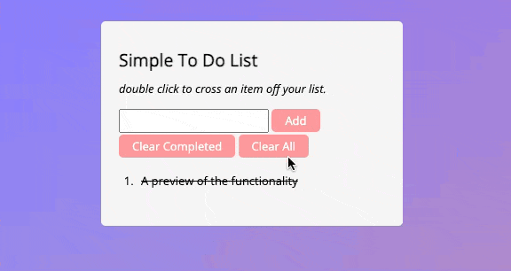

# Simple To Do List

A simple, stylish, and interactive To Do List implemented with HTML, CSS, and JavaScript.

## Preview

## Features

- **Add Tasks**: Click the "Add" button or type and hit Enter in the input field.
- **Mark Tasks as Completed**: Double-click any item inside our list to either cross it out or return it to normal.
- **Clear Input**: Click inside the "list" box to clear the input.
- **Clear All Tasks**: Click the "CA" button to remove all items from the list.
- **Clear Completed Tasks**: Click the "CC" button to remove only the crossed-out items from the list.

## Reflection on Enhancing My JS Knowledge Through the To-Do List Project

Through the creation of this To-Do List, I've reinforced several core JavaScript principles:

### 1. **Event Listeners**:

These are fundamental for capturing user interactions. The line `document.getElementById("button").addEventListener("click", addItem);` showcases how I can listen to a button click and respond by invoking the `addItem` function.

### 2. **Functions**:

Functions, like `addItem`, enable structured and reusable code. Within `addItem`, the use of conditionals (`if (checkIfEmpty.length === 0)`) ensured a smooth user experience by validating input before processing.

### 3. **DOM Manipulation**:

The ability to dynamically alter the page content is a testament to JavaScript's power. With commands like `document.createElement("li")` and `ol.appendChild(li)`, I could seamlessly add new tasks to the list.

### 4. **Looping and Automation**:

Loops allow for bulk operations on similar elements. In `clearCompleted`, the loop through `document.querySelectorAll("ol li.strike")` enabled the removal of all completed tasks with just a single click.

### 5. **Code Clarity**:

Comments and clearly named functions, like `clearInputOnFocus`, make the codebase more understandable and maintainable.

In essence, this project served as a practical reinforcement of foundational JavaScript concepts, allowing me to apply theoretical knowledge in a real-world scenario. The tangible results, a working To-Do List, brought about a sense of accomplishment and a deeper appreciation for the language's capabilities.

## Styling

All styling was sourced from two Codepen designs:

- [Design 1 by Johan Alkstal](https://codepen.io/johanalkstal/pen/AavgNz)
- [Design 2 by Bees](https://codepen.io/beeeees/pen/AJBjKR)

## Setup

To use this Todo List:

1. Clone or download the repository.
2. Open `index.html` in your browser.
3. Enjoy your interactive To Do List!
